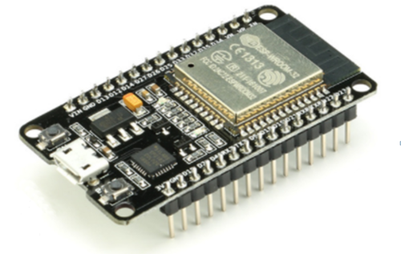

<h1>Modbus RTU to MQTT publisher for the Morningstar TS45 Charge Controller</h1>

<a href="https://www.buymeacoffee.com/r4K2HIB" target="_blank"></a>

[](https://hits.seeyoufarm.com)

[](https://github.com/ClassicDIY/TS45ToMQTT/releases)
[](https://github.com/ClassicDIY/TS45ToMQTT/releases)
[](https://github.com/ClassicDIY/TS45ToMQTT/issues)


<p>
The TS45ToMQTT publisher will read data from your Tri-Star TS-45 charge controller using the Modbus protocol and publish the data to a MQTT broker. This allows you to integrate other MQTT subscriber applications like HomeAssistant, NodeRed, InfluxDB and Grafana.

The software is provided "AS IS", WITHOUT WARRANTY OF ANY KIND, express or implied.
Classic Monitor is NOT a product of Midnite solar, nor do they support this application!
</p>

<p>
The code for the TS45ToMQTT publisher has been implemented for the 
<a href="https://github.com/ClassicDIY/TS45ToMQTT/tree/main/code/ESP32">ESP32 dev board</a> 
</p>

<p align="center">
  
</p>

<p>
Please refer to the <a href="https://github.com/ClassicDIY/TS45ToMQTT/wiki">TS45ToMQTT wiki</a> for more information.
</p>


## License
```

 Copyright (c) 2019

  Licensed under the Apache License, Version 2.0 (the "License");
  you may not use this file except in compliance with the License.
  You may obtain a copy of the License at

       http://www.apache.org/licenses/LICENSE-2.0

  Unless required by applicable law or agreed to in writing, software
  distributed under the License is distributed on an "AS IS" BASIS,
  WITHOUT WARRANTIES OR CONDITIONS OF ANY KIND, either express or implied.
  See the License for the specific language governing permissions and
  limitations under the License.

```


